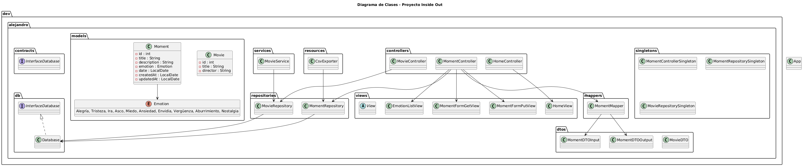
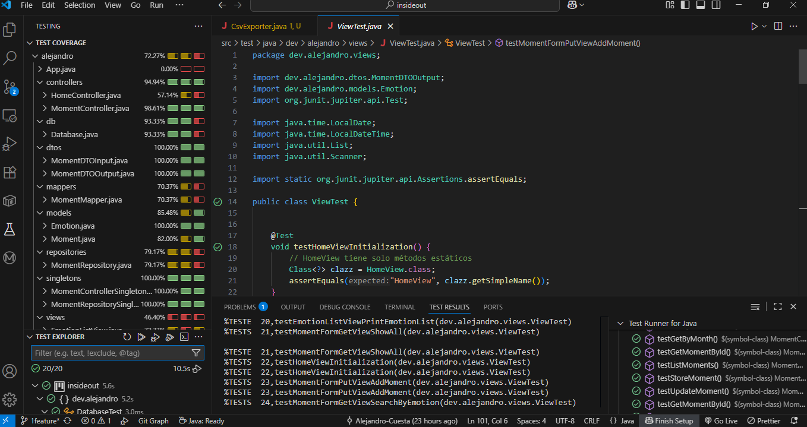

#  Inside Out 

##  Descripción
Este proyecto consiste en una aplicación de consola, donde el usuario puede gestionar momentos vividos y películas favoritas.  
Cada momento está asociado a una emoción y una fecha, y cada película puede ser añadida mediante su ID de IMDb.  

La aplicación permite:
- Añadir, listar, filtrar y eliminar momentos.
- Filtrar momentos por emoción o mes.
- Exportar los momentos a CSV.
- Añadir películas mediante IMDb ID (usando un servicio externo).
- Listar y filtrar películas por género.
- Exportar películas a CSV.


##  Pre-requisitos
Para ejecutar el proyecto necesitas:
- [Java JDK 21](https://www.oracle.com/java/technologies/javase/jdk21-archive-downloads.html)
- [Maven](https://maven.apache.org/)
- Dependencias (gestionadas con Maven):
  - Gson
  - JUnit


## ⚙️ Instalación
1. Clona el repositorio:
   ```bash
   git clone https://github.com/Alejandro-cuesta/inside-out.git
   cd inside-out


##  Diagrama de Clases




##  Cobertura de Tests




##  Autores

Alejandro Cuesta
Yelyzaveta Krasiuk